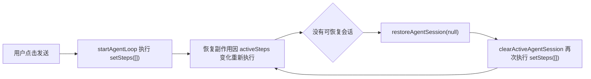

# Notus AI 面板消息发送故障排查报告

> 初次排查日期：2026-08-02；最终更新：2026-08-02；范围：本地 Web 服务、文件工作区的 Notus AI 面板。下方保留初次排查证据；本节最终状态优先。

## 最终修复与真实回归结论

初次定位的“发送后消息消失”已修复。恢复逻辑不再在新任务创建期间清空控制器，空步骤状态也不会反复触发 React 更新。自动确认模式下的多文件任务不再在首个写入后提前结束；历史抽屉的日志入口会按当前会话过滤 Agent Loop 记录；窄右侧面板按自身宽度而不是浏览器宽度响应布局。

通过应用内 Browser 在生产构建中进行了真实 Provider 回归，模型为 DeepSeek `deepseek-v4-flash`，Embedding 为 `tongyi-embedding-vision-flash-2026-03-06`。为控制费用，仅使用短指令：

1. 同一对话先后发送“甲”“乙”和一次 `read_file` 指令，三条用户消息、三条助手回复及文件读取工具回执均成功持久化。
2. 提交“两份短 Markdown 笔记”的真实 Agent 任务后立即切换到新对话；后台任务继续运行，完成 3 轮，并成功创建 `AI回归-连续一.md`、`AI回归-连续二.md`。
3. 返回原会话后，历史消息正确恢复；“查看 Agent Loop 日志”显示会话 #4 的 Agent Loop #7，包含第 1、2 轮两次“新建笔记”和第 3 轮最终回复。
4. 在约 456px 的独立右栏中检查 AI 面板，消息、输入区、模型选择和发送操作均可正常显示，没有横向溢出或控件畸形。

长文本以“粘贴”方式输入时仍会按既有安全规则转为 TXT 附件，Agent 会把附件内的指令视为外部内容而不自动执行；改为正常键入后任务可正常执行。这是附件防注入策略，不作为本轮 bug。

新增和更新的自动化验证包括 `agent-loop-auto-write-continuation.test.js`、`settings-agent-log-routing.test.js`、`file-vector-cleanup.test.js` 及既有工作区回归。完整 `npm run test:all`、`npm run lint:web`、`npm run build:web` 和 `git diff --check` 均已通过。

## 结论

已确认两项问题。其中一项会完全阻断新对话发送：新对话没有可恢复的历史会话时，工作区的会话恢复副作用会重复清空 Agent 界面状态；每次清空都会创建新的空步骤数组，反过来触发该副作用，最终出现 React 的 `Maximum update depth exceeded`。另一项发生在笔记删除：已删除笔记的文本向量没有从 `chunks_vec` 清除。

在本地浏览器实测中，点击发送后输入框立即恢复为空白状态，未出现用户消息或任务时间线，也未观察到 `/api/agent/loop/start` 的 POST。测试数据库中未新增会话、任务队列或运行事件，说明问题发生在前端提交链路，尚未进入后端持久化与 Worker。

## 测试环境与边界

- 系统：macOS；Node.js `20.19.3`；npm `10.8.2`。
- 服务：`npm run dev:web`，通过 Browser 插件在应用内浏览器以用户操作方式测试。
- 为了在没有真实凭据的环境下测试按钮与提交路径，临时创建了名为“本地回归测试”的本机 LLM 配置，并通过进程环境提供了无效的本地 Embedding 地址。未向任何模型服务发送真实请求或真实密钥。
- 连续消息测试另使用零笔记的独立数据目录，排除既有笔记未完成索引造成的发送禁用。该环境同样只使用无效的本地测试地址。
- 补充测试启动了本机 OpenAI 兼容协议模拟服务：它对 Chat Completions 返回固定文本，对 Embeddings 返回固定的 1024 维数值数组。它用于验证 Notus 的请求、任务、事件写入、数据库与向量表衔接，不是实际 LLM 或语义向量模型。
- 测试结束后，临时 LLM 配置已删除；隔离测试数据和启动过程自动生成的默认 Agent 运行时文件已移至系统废纸篓，未进入 Git 工作区。
- 随后按用户授权使用真实 Provider：DeepSeek `deepseek-v4-flash` 和千问 `tongyi-embedding-vision-flash-2026-03-06`。密钥仅用于本机设置与请求，未写入文档、日志或版本库。为控制费用，只执行了各一次连通测试、3 篇短笔记的必要索引和一次语义检索；确认前端阻断后，没有重复发送聊天请求。

## 用户路径复现结果

| 场景 | 操作 | 结果 | 判断 |
|---|---|---|---|
| 未配置模型 | 进入文件工作区，在 AI 输入框填写消息 | 发送按钮禁用，页面提示需先完成 LLM 与 Embedding 配置 | 符合现有产品规则，不作为本轮 bug |
| 仅配置 LLM | 选择本地测试 LLM 后再次填写消息 | 因 Embedding 未配置，发送仍禁用 | 符合现有产品规则，不作为本轮 bug |
| 配置 LLM 与 Embedding 前置条件 | 填写“请只回复‘已收到’。这是本地发送链路回归测试。”并点击发送 | 文本消失，界面没有新增消息或任务；浏览器持续出现 React 更新深度异常 | 已稳定复现阻断性 bug |
| 同一界面连续发送三条消息 | 在隔离数据目录依次填写并发送“第一条”“第二条”“第三条” | 三次文本均立即消失；没有用户消息、助手回复、会话或任务 | 首条问题会重复阻断后续消息，无法形成真实多轮对话 |
| 已完成历史对话的后续发送 | 先由本地协议模拟服务创建并完成一条会话，再在浏览器历史抽屉中加载该会话，点击发送后续消息 | 后续文本消失，原有两条消息保留；数据库消息数、会话数和任务数均未增加 | 不是仅发生在空白新对话 |
| 已完成历史对话的回车发送 | 在同一历史对话输入后续消息，按 Enter | 结果与点击发送相同：输入消失，未创建任务 | 键盘发送与按钮发送共用同一阻断链路 |
| 助手回复“重试” | 点击历史助手回复的“重试” | 未新增消息、会话或任务 | 重试入口同样受影响 |

前两项反映的是当前配置门槛：`aiReadiness` 需要同时满足 LLM、Embedding 与索引状态。该规则在本次 Harness 架构变更之前已经存在，且页面提示与产品文档一致，因此不能据此认定为本轮回归。

## 运行时证据

- 浏览器开发日志反复出现：`Maximum update depth exceeded. This can happen when a component calls setState inside useEffect...`。
- 发送动作后，本地服务日志中没有 `/api/agent/loop/start` 的 POST。
- 直接只读检查当前测试数据库：`agent_sessions`、`agent_task_queue`、`agent_run_events`、`agent_run_logs`、`conversations` 均为空。
- 连续三次发送后的隔离数据库仍为：`conversations=0`、`agent_sessions=0`、`agent_task_queue=0`、`agent_run_events=0`、`agent_run_logs=0`；浏览器错误日志已达到工具返回上限的 100 条更新深度异常。
- 现有静态测试 `agent-session-restore.test.js` 与 `agent-workspace-controls.test.js` 均通过，表明问题不是语法或纯函数分支错误，而是测试未覆盖真实渲染副作用的循环。
- 本地协议模拟服务下，直接请求 `/api/agent/loop/start` 可以使任务完成并写入一条用户消息、一条助手消息、`progress` 与 `final` 事件；通过 `/api/files` 创建的测试 Markdown 已索引为 4 个 chunk 和 4 条 `chunks_vec` 向量记录。说明后端任务与向量写入在协议级模拟下可运行，而浏览器提交在到达该层之前失败。

## 根因定位

触发链路如下：

对应实现位置：

1. `notus/hooks/useAgentLoopController.js:570-574`：`startAgentLoop()` 在发起请求前设置 loading 并执行 `setSteps([])`。
2. `notus/components/AgentWorkspace/FileAgentWorkspace.js:410-449`：恢复副作用把 `agentLoop.activeSteps` 放进依赖数组；无历史会话时会调用 `restoreAgentSession(null)`。
3. `notus/utils/agentSessionRestore.js:1-7`：当没有已恢复会话、活动会话、步骤和流式文本时，`shouldClearAgentPresentation()` 返回 `true`。
4. `notus/hooks/useAgentLoopController.js:466-478`：`restoreAgentSession(null)` 会进入 `clearActiveAgentSession()`，其中无条件执行 `setSteps([])`。

React 对基本类型的相同值通常会跳过重复更新，但新的空数组不是同一引用。因此，副作用依赖项 `activeSteps` 每次都会被视为变化，产生无限更新。提交链路因这一循环无法完成，用户看到的就是“消息发送不了”。

通过 Git 历史比对，这段清空分支和 `shouldClearAgentPresentation()` 由 `024a50f fix(agent): 稳定任务回显与工作台状态` 引入，位于此前 Harness 持久化任务架构提交 `e796a6e` 之后。

## 建议的后续修复范围

本轮不改代码。下一轮可按以下范围处理：

1. 将历史会话恢复副作用改为依赖稳定的“历史会话已加载”和会话标识，不以会被该副作用自身重置的 `activeSteps`、流式文本作为清空触发条件。
2. 无历史会话不应重复调用 `restoreAgentSession(null)`；可以用引用记录本轮恢复是否已处理。
3. 在 `clearActiveAgentSession()` 增加幂等保护：无活动会话、无步骤、无流式文本且未加载时不重复写入状态。该措施是补充保护，不能替代第 1 项。
4. 新增组件级或浏览器级回归：新对话连续发送三条消息时，断言每条各只请求一次 `/api/agent/loop/start`、用户消息顺序保留、不会出现更新深度异常；同时覆盖刷新后的恢复、已有会话续发和切换会话后返回。

## 真实 Provider 验证

千问真实连通测试成功，返回 768 维向量。删除既有 4 篇笔记后，新建了“真实测试-城市规划”“真实测试-产品方案”“真实测试-发布记录”3 篇短笔记，均完成真实向量索引；`/api/setup/status` 返回 `total=3`、`indexed=3`。以“AI 面板在同一对话里应该支持什么？”检索时，结果命中“真实测试-产品方案”的正文，证明当前真实 Embedding 写入和召回可以工作。

DeepSeek 真实连通测试成功。在浏览器中选中该配置并发送一条“只回复‘已收到’，不要调用工具”的短消息，仍在前端立即失败。提交后 `conversations`、`messages`、`agent_sessions`、`agent_task_queue`、`agent_run_events`、`agent_run_usage` 全为 0，浏览器开发日志记录 100 条更新深度异常。这次没有进入 DeepSeek 的聊天调用，因此无需再用相同消息重复消耗额度。

删除笔记后，数据库中的 `files=3`、`chunks=12`，但 `chunks_vec=23`。其中 11 条记录的 `chunk_id` 在现存 `chunks` 表中不存在，确认已删除笔记留下了孤立向量。删除路径位于 `notus/lib/files.js:deleteFile()`，只删除文件与 `files` 记录；向量清理函数 `notus/lib/indexer.js:deleteOldVectors()` 没有被该路径调用。该问题已登记为 `BUG-20260802-002`。

尚未覆盖的是一次完整、成功的真实 Agent 多轮回复、流式分块和工具调用，因为前端问题会在请求模型前阻断发送。待修复 `BUG-20260802-001` 后，应以这 3 篇笔记为数据集，用短消息验证首条、连续三条、历史会话续发和重试，并保留明确的调用上限。

## 文档记录

本次已更新 `docs/Bug台账.md` 的 `BUG-20260802-001` 和新增的 `BUG-20260802-002`。本次属于 bug 复现与定位，未新增或更新非 bug 需求台账，也没有变更产品行为，因此产品设计、技术实现、进度和界面规范文档不需要调整。
