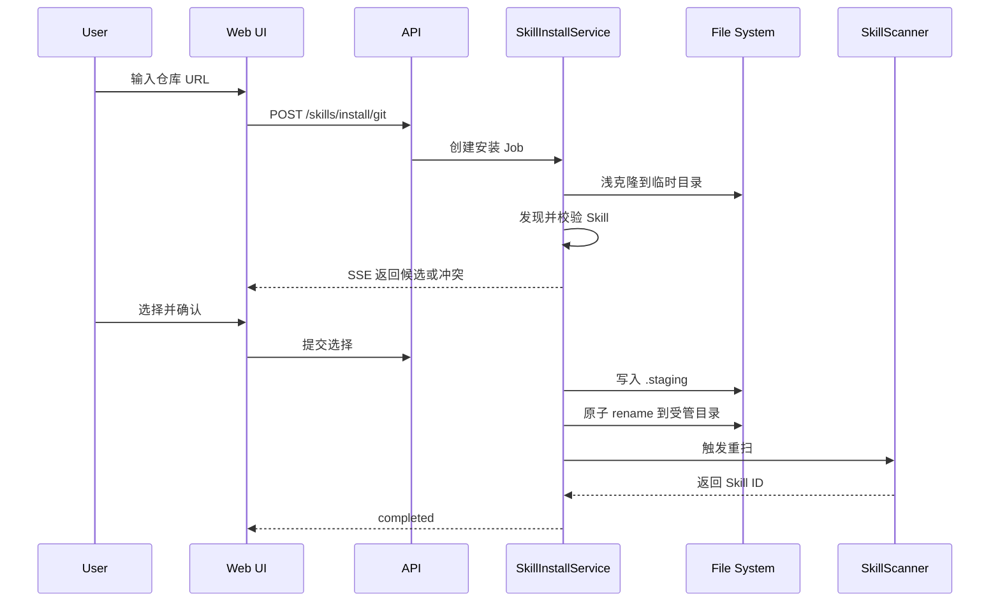
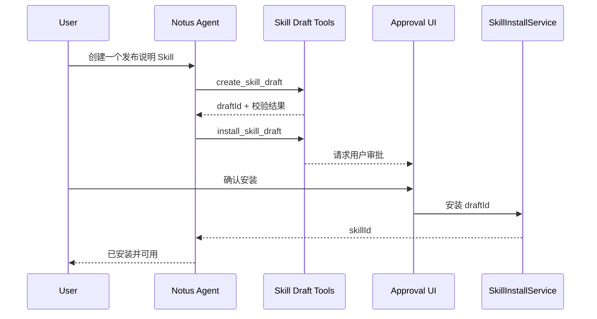
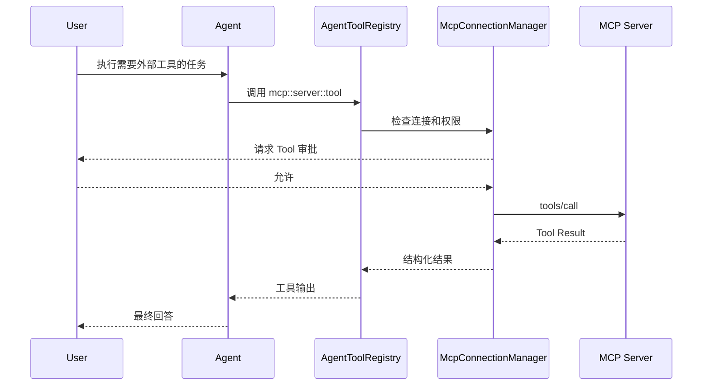

# Notus Skill 与 MCP 实现设计文档

文档版本：1.0
编写日期：2026-07-19
适用范围：Notus Web 应用、Electron 桌面端、懒猫微服 LPK 部署
实现语言假设：TypeScript、Node.js、Web SPA、Electron

## 1. 文档目标

本文定义 Notus 第一版 Skill 与 MCP 的完整实现方案。实现同时运行在两类环境中：

- Electron 桌面端。Web 前端由 Electron 包装，本地 Node.js 服务拥有文件系统和子进程权限。
- 懒猫微服。Web 前端和 Node.js 服务运行在 LPK 应用容器中，应用数据写入 `/lzcapp/var`。

第一版交付范围如下：

- 读取、校验、索引和按需加载符合 Agent Skills 规范的 Skill。
- Electron 环境自动扫描并监测 Codex、Claude Code、OpenCode 等工具的 Skill 目录。
- 懒猫环境只创建和管理 Notus 自己的 Skill 目录，不扫描宿主机或其他 Agent 的目录。
- 支持通过 GitHub、GitLab、Gitee 等 HTTPS Git 仓库地址安装 Skill。
- 已通过 Git 安装的受管 Skill 支持用户手动拉取 `main` / `master` 更新；不做后台检查或自动同步。
- 支持导入 ZIP 压缩包安装 Skill。
- 支持 Notus 内置 Agent 创建 Skill 草稿，并在用户确认后安装。
- MCP 支持 stdio 和 Streamable HTTP 两种传输。
- stdio 只在 Electron 环境启用。懒猫环境的后端拒绝 stdio 配置，设置页面也不展示 stdio 入口。
- Skill 和 MCP 都在设置页面中完成查看、安装、编辑、启停、测试和删除。

第一版不包含旧版 HTTP+SSE、WebSocket、MCP OAuth、Plugin Marketplace、Skill 自动升级、Skill 签名、MCP Resources 和 MCP Prompts。文档末尾保留了这些能力的扩展接口。

## 2. 设计结论

### 2.1 Skill 安装目录

Electron 的 Notus 全局 Skill 安装目录固定为：

```text
$HOME/.agents/skills
```

选择该目录有两个原因：Codex 将它作为用户级 Skill 目录，OpenCode 也兼容该目录。Notus 同时扫描 Claude Code 和 OpenCode 的其他全局目录，但不会把安装结果复制到多个目录。

懒猫微服的 Skill 安装目录固定为：

```text
/lzcapp/var/notus/skills
```

该目录由 Notus 创建。安装、删除、索引、监测和 Agent 创建都只能发生在这里。服务端不接受客户端传入任意安装路径。

### 2.2 外部 Skill 的管理边界

Electron 扫描到的外部 Skill 分成两类：

- Notus 安装记录中存在的 Skill，标记为 `managed`。设置页允许重新安装、删除和查看来源。
- 用户原先放在 Codex、Claude Code、OpenCode 目录中的 Skill，标记为 `external`。设置页允许启停、查看和打开目录，默认不允许删除文件。

即使某个外部 Skill 位于 `$HOME/.agents/skills`，只要数据库中没有对应的 Notus 安装记录，它仍然按 `external` 处理。这样可以避免 Notus 删除用户原有文件。

### 2.3 MCP 传输范围

Electron：

```text
stdio
Streamable HTTP
```

懒猫微服：

```text
Streamable HTTP
```

运行环境能力由后端返回。前端只依据能力对象渲染表单，不能依赖 User-Agent、域名或 `window.electron` 自行猜测。

### 2.4 MCP 协议范围

第一版实现这些协议操作：

```text
initialize
notifications/initialized
tools/list
tools/call
notifications/tools/list_changed
ping
```

Server Instructions 会保存并加入对应 MCP Server 的 Agent 工具说明。Resources、Prompts、Sampling、Elicitation 和 Tasks 暂不暴露给 Agent。

### 2.5 Agent 跨轮资源承接

Agent 不能只根据上一轮自然语言判断“这个”“它”“改名”指向哪个 Skill 或 MCP Server。每个新 session 从同一 `conversation_id` 的成功资源工具日志和已完成资源确认中取回稳定 ID，再从当前 Skill/MCP 存储重新读取对象；这一步不新建上下文表，也不保存资源副本。

系统只向 Prompt 注入少量、已重新校验的候选。Skill 必须仍为 `valid`，MCP Server 必须仍存在；已删除、缺失或失效对象不参与承接。最近资源操作只有一个同类对象时标为当前对象，Agent 先按 ID 查询或管理该对象，不能把它解释成工作区文章或文件；同一最近操作中有多个同类对象时必须先澄清。工具日志只保留 ID、名称、启停、传输、确认和测试摘要，不保存 Header、env、Token 或 Skill 正文。

## 3. 功能矩阵

| 功能 | Electron | 懒猫微服 |
|---|---:|---:|
| Notus 全局 Skill 目录 | `$HOME/.agents/skills` | `/lzcapp/var/notus/skills` |
| 扫描 Codex 全局目录 | 支持 | 不支持 |
| 扫描 Claude Code 全局目录 | 支持 | 不支持 |
| 扫描 OpenCode 全局目录 | 支持 | 不支持 |
| 扫描当前工作区项目目录 | 支持 | 不支持 |
| 监测外部 Skill 文件变化 | 支持 | 不支持 |
| 监测 Notus Skill 目录 | 支持 | 支持 |
| Git HTTPS 安装 | 支持 | 支持 |
| ZIP 安装 | 支持 | 支持 |
| Agent 创建并安装 Skill | 支持 | 支持 |
| MCP stdio | 支持 | 后端拒绝，前端隐藏 |
| MCP Streamable HTTP | 支持 | 支持 |
| 打开本地 Skill 目录 | 支持 | 不展示 |
| 直接删除外部 Skill 文件 | 默认禁止 | 不涉及 |

## 4. 总体架构

建议采用同一套领域服务、两套运行时适配器。Web 前端、API DTO、数据库模型和业务逻辑保持一致，文件系统、进程管理、密钥保存和运行环境能力由适配器实现。

```text
┌────────────────────────────────────────────────────────────┐
│                         Web SPA                            │
│  Settings / Agent Chat / Skill UI / MCP UI                │
└──────────────────────────┬─────────────────────────────────┘
                           │ HTTP + SSE
┌──────────────────────────▼─────────────────────────────────┐
│                    Notus Application API                   │
│ RuntimeCapabilityService                                  │
│ SkillService / SkillInstallService / SkillWatcher          │
│ McpConfigService / McpConnectionManager / AgentToolBridge  │
└───────────────┬───────────────────────────────┬────────────┘
                │                               │
     ┌──────────▼──────────┐          ┌────────▼───────────┐
     │ Electron Adapters   │          │ LazyCat Adapters   │
     │ local fs            │          │ /lzcapp/var fs     │
     │ external scanners   │          │ single skill root  │
     │ child_process       │          │ no stdio adapter   │
     │ OS secret storage   │          │ encrypted secrets  │
     └─────────────────────┘          └────────────────────┘
```

### 4.1 推荐工程目录

```text
apps/
  web/                         # 设置页与 Agent 页面
  server/                      # 通用 Node.js API 服务
  electron/                    # Electron main、preload、打包配置
packages/
  domain/                      # 实体、状态机、错误码
  runtime/                     # 环境识别与能力矩阵
  skills/                      # 扫描、校验、监测、安装、加载
  mcp/                         # MCP 配置、连接、工具桥接
  persistence/                 # SQLite repository 与迁移
  security/                    # 密钥、URL、ZIP、路径校验
  shared/                      # DTO、schema、事件类型
```

### 4.2 Electron 运行方式

Electron main 启动同一份 `apps/server`：

- 绑定 `127.0.0.1` 的随机端口。
- 启动时设置 `NOTUS_RUNTIME_TARGET=electron`。
- 生成一次性的 256 位本地 API Token，通过 preload 暴露给渲染进程。
- Web 页面请求本地 API 时携带该 Token。
- `BrowserWindow` 设置 `nodeIntegration: false`、`contextIsolation: true`、`sandbox: true`。
- 渲染进程不能直接调用 `fs`、`child_process` 或读取环境变量。

也可以使用 IPC 调用同一组领域服务。为了复用懒猫端的接口和前端请求代码，第一版推荐本地 HTTP 服务。

### 4.3 懒猫运行方式

LPK 容器直接启动 `apps/server`：

- 设置 `NOTUS_RUNTIME_TARGET=lazycat`。
- Web 页面与 API 保持同源。
- 数据、数据库、安装记录和 Skill 都保存在 `/lzcapp/var/notus`。
- 不注册 stdio transport adapter。
- 不扫描 `/root`、`/home`、`/lzcapp/run/mnt/home` 或其他应用目录。

## 5. 运行环境识别与能力控制

### 5.1 环境识别

运行模式由启动器显式传入：

```ts
export type RuntimeKind = 'electron' | 'lazycat';

export function detectRuntime(): RuntimeKind {
  const value = process.env.NOTUS_RUNTIME_TARGET;

  if (value === 'electron' || value === 'lazycat') {
    return value;
  }

  if (process.versions?.electron) {
    return 'electron';
  }

  throw new Error('NOTUS_RUNTIME_TARGET is missing or invalid');
}
```

Electron 如果把 API 服务放进普通 Node.js child process，`process.versions.electron` 可能不存在，因此 Electron main 必须给子进程传入 `NOTUS_RUNTIME_TARGET=electron`。

懒猫镜像必须在 `lzc-manifest.yml` 中设置 `NOTUS_RUNTIME_TARGET=lazycat`。代码不依赖域名、文件路径是否存在或浏览器特征判断环境。

### 5.2 能力对象

```ts
export interface RuntimeCapabilities {
  runtime: RuntimeKind;
  skills: {
    managedRoot: string;
    discoverExternalRoots: boolean;
    discoverWorkspaceRoots: boolean;
    installFromGit: boolean;
    installFromZip: boolean;
    createFromAgent: boolean;
    openFolder: boolean;
  };
  mcp: {
    stdio: boolean;
    streamableHttp: boolean;
  };
}

export const runtimeCapabilities: Record<RuntimeKind, RuntimeCapabilities> = {
  electron: {
    runtime: 'electron',
    skills: {
      managedRoot: '~/.agents/skills',
      discoverExternalRoots: true,
      discoverWorkspaceRoots: true,
      installFromGit: true,
      installFromZip: true,
      createFromAgent: true,
      openFolder: true,
    },
    mcp: {
      stdio: true,
      streamableHttp: true,
    },
  },
  lazycat: {
    runtime: 'lazycat',
    skills: {
      managedRoot: '/lzcapp/var/notus/skills',
      discoverExternalRoots: false,
      discoverWorkspaceRoots: false,
      installFromGit: true,
      installFromZip: true,
      createFromAgent: true,
      openFolder: false,
    },
    mcp: {
      stdio: false,
      streamableHttp: true,
    },
  },
};
```

### 5.3 能力接口

```http
GET /api/v1/runtime/capabilities
```

返回示例：

```json
{
  "runtime": "lazycat",
  "skills": {
    "managedRoot": "/lzcapp/var/notus/skills",
    "discoverExternalRoots": false,
    "discoverWorkspaceRoots": false,
    "installFromGit": true,
    "installFromZip": true,
    "createFromAgent": true,
    "openFolder": false
  },
  "mcp": {
    "stdio": false,
    "streamableHttp": true
  }
}
```

### 5.4 前后端双重限制

前端：

```ts
const transportOptions = [
  capabilities.mcp.stdio && { value: 'stdio', label: '标准输入/输出' },
  capabilities.mcp.streamableHttp && {
    value: 'streamable_http',
    label: 'Streamable HTTP',
  },
].filter(Boolean);
```

后端：

```ts
function assertTransportAllowed(
  transport: 'stdio' | 'streamable_http',
  capabilities: RuntimeCapabilities,
): void {
  if (transport === 'stdio' && !capabilities.mcp.stdio) {
    throw new AppError(
      'MCP_TRANSPORT_UNAVAILABLE',
      'stdio transport is unavailable in the current runtime',
      422,
    );
  }
}
```

懒猫环境还要执行以下限制：

- 创建、修改、导入 MCP 配置时拒绝 `transport=stdio`。
- 服务启动时发现数据库中残留的 stdio 配置，立即设为 `disabled` 和 `unsupported`。
- `GET /mcp/servers` 默认不向普通设置页返回这类遗留项。
- MCP transport factory 不包含 stdio 模块的静态导入。

## 6. Skill 目录设计

### 6.1 Electron 的受管目录

```ts
import os from 'node:os';
import path from 'node:path';

export function getElectronManagedSkillRoot(): string {
  return path.join(os.homedir(), '.agents', 'skills');
}
```

该目录也是 Codex 用户级 Skill 目录。OpenCode支持读取 `.agents/skills`。Claude Code 不读取该目录，第一版只扫描 Claude Code 的目录，不自动创建跨目录副本或符号链接。

### 6.2 Electron 的外部扫描目录

全局目录：

```text
Codex / Agent Skills
$HOME/.agents/skills

Claude Code
${CLAUDE_CONFIG_DIR}/skills
缺省为 $HOME/.claude/skills

OpenCode
${OPENCODE_CONFIG_DIR}/skills
缺省为 $HOME/.config/opencode/skills

Codex 管理员目录，仅 macOS/Linux 且目录存在时读取
/etc/codex/skills
```

OpenCode 同时兼容 `$HOME/.agents/skills` 和 `$HOME/.claude/skills`。扫描器按真实路径去重，不能因为一个目录属于多个 Provider 就生成多份 Skill。

当前工作区目录在 Electron 中按需扫描。用户选择本地工作区后，从工作目录向上走到 Git 根目录，读取：

```text
.agents/skills/*/SKILL.md
.claude/skills/*/SKILL.md
.opencode/skills/*/SKILL.md
```

Claude Code 还会发现工作目录以下的嵌套 `.claude/skills`。Notus 第一版只在用户实际打开或索引某个子目录时追加该子目录的 Skill root，避免递归扫描整个大型 Monorepo。

### 6.3 懒猫目录

```text
/lzcapp/var/notus/
├── data/
│   └── notus.sqlite
├── skills/
│   ├── <skill-name>/
│   │   └── SKILL.md
│   └── .staging/
├── secrets/
├── logs/
└── state/
```

`/lzcapp/var` 用于应用内部持久化数据。Skill、数据库、安装来源和运行状态都写入这里。ZIP 下载缓存可以写入 `/lzcapp/cache/notus`，安装 staging 仍放在 `/lzcapp/var/notus/skills/.staging`，保证最终目录替换可以使用同一文件系统内的原子 `rename`。

### 6.4 Root Registry

不要把目录散落在扫描代码中。每个目录先转成 `SkillRoot`：

```ts
export interface SkillRoot {
  id: string;
  path: string;
  scope: 'managed' | 'user' | 'workspace' | 'admin';
  providers: Array<'notus' | 'codex' | 'claude-code' | 'opencode'>;
  writable: boolean;
  managedByNotus: boolean;
  watch: boolean;
  priority: number;
}
```

Electron 示例：

```ts
[
  {
    path: '~/.agents/skills',
    scope: 'managed',
    providers: ['notus', 'codex', 'opencode'],
    writable: true,
    managedByNotus: true,
    watch: true,
    priority: 100,
  },
  {
    path: '~/.claude/skills',
    scope: 'user',
    providers: ['claude-code', 'opencode'],
    writable: true,
    managedByNotus: false,
    watch: true,
    priority: 80,
  },
  {
    path: '~/.config/opencode/skills',
    scope: 'user',
    providers: ['opencode'],
    writable: true,
    managedByNotus: false,
    watch: true,
    priority: 70,
  },
]
```

懒猫只生成一条记录：

```ts
[
  {
    path: '/lzcapp/var/notus/skills',
    scope: 'managed',
    providers: ['notus'],
    writable: true,
    managedByNotus: true,
    watch: true,
    priority: 100,
  },
]
```

## 7. Skill 文件格式与校验

### 7.1 目录结构

```text
skill-name/
├── SKILL.md
├── scripts/
├── references/
├── assets/
└── 其他支持文件
```

`SKILL.md` 使用 YAML Frontmatter 和 Markdown 正文：

```markdown
---
name: release-note
description: 根据 Git 提交生成发布说明。用户要求整理 changelog、版本变更或发布记录时使用。
license: MIT
compatibility: Requires git
metadata:
  author: notus
  version: "1.0.0"
---

## 工作流程

读取版本范围内的提交记录，按新增、修复和工程调整整理输出。
```

### 7.2 第一版读取字段

```text
name                 必填
description          必填
license              可选
compatibility        可选
metadata             可选
allowed-tools        可选，保留并进入权限提示
```

Claude Code、Codex 或其他工具增加的 Frontmatter 字段保存在 `frontmatter_json` 中。Notus 第一版不执行 `context: fork`、`hooks`、`shell`、动态命令注入等私有字段。

### 7.3 校验规则

- `SKILL.md` 必须存在且是普通文件。
- YAML Frontmatter 必须可解析。
- `name` 长度为 1 到 64。
- `name` 匹配 `^[a-z0-9]+(-[a-z0-9]+)*$`。
- `name` 与父目录名一致。
- `description` 长度为 1 到 1024。
- `compatibility` 最长 500 字符。
- `metadata` 必须是键值对象。
- `SKILL.md` 默认最大 1 MiB，超过后标记为无效。
- Skill 内部符号链接不能逃出 Skill 根目录。
- 所有相对文件路径都经过 `realpath` 和目录包含关系校验。
- 单个 Skill 默认最大 512 MiB，最大 20,000 个文件。限制通过服务端配置调整。

### 7.4 Skill 状态

```ts
export type SkillStatus =
  | 'valid'
  | 'invalid'
  | 'missing'
  | 'conflict'
  | 'disabled'
  | 'quarantined';
```

`invalid` 记录具体错误，例如：

```json
[
  { "code": "SKILL_NAME_MISMATCH", "message": "name 与目录名不一致" },
  { "code": "SKILL_DESCRIPTION_REQUIRED", "message": "description 不能为空" }
]
```

无效 Skill 可以出现在设置页，不能进入 Agent 的可用 Skill 列表。

## 8. Skill 扫描与监测

### 8.1 启动流程

```text
创建运行时能力
  → 解析 SkillRoot 列表
  → 创建缺失的受管目录
  → 对每个 Root 做一次完整扫描
  → 写入或更新索引
  → 删除本轮未见且文件已不存在的索引项
  → 启动文件监测
  → 启动周期性 reconcile
```

### 8.2 扫描规则

每个 Root 默认读取：

```text
<root>/*/SKILL.md
```

扫描器跳过：

```text
.git
node_modules
.staging
.DS_Store
隐藏的临时编辑文件
```

ZIP 包内部可继续发现多个 Skill；Git 安装固定为一仓库一个 Skill：只接受仓库根目录的 `SKILL.md`，不递归把支持目录中的 `SKILL.md` 当成独立 Skill。

### 8.3 真实路径去重

同一个 Skill 可能通过符号链接出现在多个目录。去重流程：

1. 对 Skill 目录执行 `realpath`。
2. 使用 `real_path + content_hash` 查找现有记录。
3. 已存在时追加 Provider 和 Root 关联，不创建第二个 Agent Skill ID。
4. 符号链接目标变化后重新计算关联。
5. 检测符号链接循环，超过 16 层立即停止。

### 8.4 文件监测

推荐使用 `chokidar`。监测范围包含整个 Skill 目录，原因是 `scripts`、`references` 和 `assets` 的变化也会改变 Skill 内容。

```ts
const watcher = chokidar.watch(root.path, {
  persistent: true,
  ignoreInitial: true,
  depth: 5,
  awaitWriteFinish: {
    stabilityThreshold: 500,
    pollInterval: 100,
  },
  ignored: [
    '**/.git/**',
    '**/node_modules/**',
    '**/.staging/**',
    '**/*.swp',
    '**/*~',
  ],
});
```

事件处理：

```text
add / change / unlink
  → 找到所属 Skill 根目录
  → 500ms debounce
  → 重新读取整个 Skill
  → 校验
  → 计算 hash
  → 更新数据库
  → 发送 skill.changed 事件

addDir / unlinkDir
  → 重新扫描对应 Root 的一级目录
```

每次全量扫描使用同一个批次标记。只有未写入当前批次标记的旧记录才能转为 `missing`，不能用逐条采样时间与扫描结束时间比较。

如果某个 Root 启动时不存在，扫描器监测它的父目录。目录创建后自动注册新的 watcher，不要求重启 Notus。

### 8.5 周期性校正

文件 watcher 可能在休眠、网络磁盘或大量变更时漏事件。Electron 和懒猫都执行周期性 reconcile：

```text
Electron：每 5 分钟
懒猫：每 2 分钟
```

reconcile 比较目录快照、mtime、文件数量和内容 hash。应用从系统休眠恢复后立即执行一次。

### 8.6 内容 Hash

对 Skill 目录中的普通文件按相对路径排序，计算 SHA-256：

```text
hash(
  relativePath + "\0" + fileSize + "\0" + fileBytes
)
```

排除 `.git`、`.notus-tmp` 和操作系统临时文件。Hash 用于变更检测、安装回滚、来源追踪和重复 Skill 判断。

### 8.7 同名冲突

同名 Skill 可以来自不同目录。数据库 ID 使用 UUID，Agent 调用使用 UUID，不能只用 `name`。

设置页显示：

```text
release-note · Notus Managed
release-note · Claude Code
release-note · Workspace: project-a
```

来源和受管归属属于后端管理信息，不在当前紧凑列表行显示；列表只展示 Skill 名称、描述与启停开关。该信息仍可用于冲突处理和服务端审计。

Agent 初始列表中附带 `sourceLabel`。自动选择时按以下顺序排序：

```text
当前工作区 Skill
Notus 受管全局 Skill
用户级外部 Skill
管理员级 Skill
```

同一优先级仍有多个候选时，Agent 得到候选列表并按描述判断，不做静默覆盖。

## 9. Skill 在 Agent 中的加载

### 9.1 渐进加载

会话开始时只给模型提供：

```ts
interface AgentSkillSummary {
  id: string;
  name: string;
  description: string;
  sourceLabel: string;
}
```

Agent 需要使用某个 Skill 时调用：

```text
load_skill(skillId)
```

返回：

- 解析后的 Frontmatter。
- `SKILL.md` 正文。
- Skill 根目录中的文件清单摘要。
- 允许继续读取的相对路径边界。

支持文件使用：

```text
read_skill_file(skillId, relativePath)
```

所有读取都经过路径包含校验、文件大小限制和文本/二进制类型判断。

### 9.2 脚本处理

安装阶段不执行 Skill 内的脚本。Agent 使用脚本时仍要经过 Notus 现有的 Shell 或代码执行工具权限。

懒猫环境是否允许执行 Skill 脚本由 Agent 工具层决定，和 Skill 安装目录无关。第一版可以只加载指令和参考文件，暂不向 Agent 自动提供 Skill 脚本执行入口。

### 9.3 启停

Skill 的启停状态保存在 Notus 数据库中，不移动、不重命名外部目录。关闭某个 Skill 只影响 Notus Agent，Codex、Claude Code 和 OpenCode 的行为保持不变。

## 10. Skill 安装系统

### 10.1 统一安装事务

Git、ZIP 和 Agent 草稿共用同一条安装流水线：

```text
接收来源
  → 创建安装 Job
  → 下载或读取到临时目录
  → 安全检查
  → 发现 Skill 候选
  → 校验 SKILL.md
  → 展示候选与冲突
  → 复制到受管 Root 的 staging 目录
  → 再次校验与计算 hash
  → 原子替换目标目录
  → 写入安装来源和审计日志
  → 触发扫描
  → 返回安装结果
```

目标目录由后端计算：

```ts
export function resolveManagedSkillRoot(runtime: RuntimeKind): string {
  if (runtime === 'electron') {
    return path.join(os.homedir(), '.agents', 'skills');
  }
  return '/lzcapp/var/notus/skills';
}
```

API、Agent Tool 和前端都不能传入 `targetPath`。

### 10.2 原子安装

安装目录：

```text
<managed-root>/.staging/<job-id>/<skill-name>
```

提交步骤：

1. 在 staging 中写完整目录。
2. 校验目录和 Hash。
3. 目标不存在时执行 `rename(staging, target)`。
4. 目标存在且用户选择替换时，把旧目录改名为 `.backup-<job-id>`。
5. 把 staging 改名为目标目录。
6. 写数据库记录。
7. 删除 backup。
8. 任一步失败时恢复 backup。

同一 Skill 名称使用进程内 mutex。多进程部署时再加数据库锁或文件锁。

### 10.3 Git 仓库安装

#### 支持范围

第一版支持：

```text
https://github.com/<owner>/<repo>.git
https://gitlab.com/<owner>/<repo>.git
https://gitee.com/<owner>/<repo>.git
其他可通过 HTTPS clone 的 Git 服务
```

可选参数：

```ts
interface InstallSkillFromGitInput {
  repositoryUrl: string;
  ref?: string;
  subdirectory?: string;
  selectedSkillPaths?: string[];
  credentialId?: string;
  conflictPolicy: 'reject' | 'replace';
}
```

第一版不支持：

```text
SSH clone
Git submodule 自动初始化
Git LFS 自动下载
任意 post-install 脚本
本地 file:// 仓库 URL
```

Electron 和懒猫使用相同的 Git HTTPS 实现。推荐使用纯 Node.js Git 客户端，避免要求用户电脑或懒猫镜像预装 `git`。私有仓库通过 HTTPS Token 访问，Token 存入密钥存储，不能写入仓库 URL、日志或安装记录。

#### URL 处理

- 只接受 `https:`。
- 禁止 URL 中携带明文密码。
- 对 GitHub、GitLab、Gitee 的网页地址做规范化。
- 支持用户粘贴仓库主页和标准 clone URL。
- `ref` 可以是 branch、tag 或 commit SHA。
- 记录最终解析出的 commit SHA。
- HTTP 重定向最多 3 次，每次重新执行域名和地址校验。

#### Clone 与候选发现

```text
浅克隆指定 ref
  → 排除 .git
  → 先检查仓库根目录 SKILL.md
  → 再检查 skills/*/SKILL.md
  → 再在最大深度 4 内搜索
  → 返回候选列表
```

发现一个候选时直接进入预览。发现多个候选时，让用户选择一个或多个。Agent 发起安装时也必须生成候选选择或明确的 `subdirectory`。

#### 来源记录

```json
{
  "method": "git",
  "repositoryUrl": "https://github.com/example/skills.git",
  "ref": "main",
  "commit": "2b7c...",
  "subdirectory": "skills/release-note",
  "installedAt": "2026-07-19T00:00:00Z"
}
```

第一版的“更新”由用户在设置页手动触发：重新拉取同一来源的 `main` / `master`，要求 Frontmatter `name` 不变，staging 校验后以备份目录交换。失败恢复旧目录、旧索引和启停状态；不做后台检查、Hash/Diff 预览或自动定时更新。

### 10.4 ZIP 安装

Electron 和懒猫都使用浏览器文件上传：

```http
POST /api/v1/skills/install/zip
Content-Type: multipart/form-data
```

默认限制：

```text
压缩包最大 100 MiB
解压后最大 512 MiB
最多 20,000 个条目
单文件最大 128 MiB
最多嵌套目录深度 32
```

ZIP 安全检查：

- 拒绝绝对路径。
- 拒绝包含 `..`、空字节或 Windows 盘符的条目。
- 解压后的真实路径必须位于临时目录。
- 默认拒绝 ZIP 中的符号链接和硬链接。
- 在写文件前检查累计解压大小，防止 Zip Bomb。
- 不自动执行脚本。
- 不自动递归解压 ZIP 中的其他压缩包。
- MIME、扩展名和文件头三者至少两项匹配。

解压后使用和 Git 相同的 Skill 候选发现与安装事务。

设置页 ZIP 弹窗使用单一的拖放/点击上传区。未选文件时仅保留上传动作和 `100 MiB` 上限，选中后在同一区域展示文件名与大小；默认拒绝同名 Skill，用户显式开启覆盖后才提交 `replace`；路径、链接、文件数和解压限制继续由服务端执行，不在弹窗展示说明文字。

### 10.5 冲突处理

同名目标已存在时，前端展示：

```text
目标路径
现有来源
新来源
现有 Hash
新 Hash
SKILL.md Diff
```

策略：

- `reject`：默认，返回 `SKILL_ALREADY_EXISTS`。
- `replace`：需要用户明确确认。

第一版不自动改名。Agent Skills 规范要求目录名与 Frontmatter `name` 一致，自动追加后缀会改动第三方 Skill 内容。

### 10.6 删除

只有 `managed=true` 且存在 Notus 安装记录的 Skill 可以直接删除。

删除流程：

```text
校验受管目录边界
  → 移动到 .trash/<job-id>
  → 更新数据库
  → 触发扫描
  → 异步清理 trash
```

外部 Skill 的删除操作显示为“从 Notus 停用”。桌面端可以额外提供“在文件管理器中打开”。

## 11. Agent 创建和安装 Skill

### 11.1 Agent Tools

为 Notus Agent 提供三个内部工具：

```text
create_skill_draft
validate_skill_draft
install_skill_draft
```

#### create_skill_draft

```ts
interface CreateSkillDraftInput {
  name: string;
  description: string;
  instructions: string;
  files?: Array<{
    path: string;
    content: string;
  }>;
}
```

输出草稿 ID，不写入正式 Skill 目录：

```text
<notus-data>/state/skill-drafts/<draft-id>/
```

#### validate_skill_draft

返回 Frontmatter 校验、文件清单、权限提示和风险项。

#### install_skill_draft

Agent 只传 `draftId` 和冲突策略。后端根据运行环境决定目标目录：

```text
Electron → $HOME/.agents/skills
懒猫 → /lzcapp/var/notus/skills
```

### 11.2 用户确认

`install_skill_draft` 属于有文件写入副作用的工具。Agent 发起后，前端显示审批卡片：

```text
Skill 名称
安装目录
将创建的文件
脚本文件
allowed-tools
冲突状态
```

用户确认后执行安装。拒绝后保留草稿 24 小时，之后清理。

### 11.3 Agent 生成约束

- Agent 不能在草稿中写绝对路径。
- Agent 不能写出草稿目录。
- Agent 生成的 `name` 必须通过标准校验。
- Agent 不能在安装阶段请求执行脚本。
- `allowed-tools` 只作为权限申请展示，不自动授权。
- 草稿最大 20 MiB，单文件最大 2 MiB；较大二进制 asset 通过后续人工导入处理。

## 12. Skill 设置页面

路由建议：

```text
/settings/skills
/settings/skills/:skillId
```

### 12.1 列表页

显示：

```text
名称
description
状态
来源 Provider
作用域
安装方式
最后修改时间
启用状态
```

筛选：

```text
全部
Notus 管理
外部发现
当前工作区
无效
已停用
```

懒猫环境不显示“外部发现”和“当前工作区”筛选。

### 12.2 顶部操作

```text
从 Git 仓库安装
导入 ZIP
让 Agent 创建
重新扫描
```

Electron 额外显示：

```text
打开全局 Skill 目录
查看扫描目录
```

懒猫只显示受管目录的逻辑名称，默认不向普通用户暴露容器内部文件浏览入口。

### 12.3 详情页

- Frontmatter。
- `SKILL.md` 预览。
- 支持文件树。
- 来源和 commit。
- 内容 Hash。
- 校验结果。
- 变更时间。
- 启用开关。
- managed Skill 的重新安装和删除。
- external Skill 的打开目录和从 Notus 停用。

### 12.4 安装进度

安装接口创建 Job。前端通过 SSE 接收：

```text
validating_source
cloning_or_uploading
extracting
finding_skills
waiting_for_selection
validating_skill
installing
indexing
completed
failed
```

进度事件中不输出 Token、Authorization Header、仓库凭据或完整环境变量。

## 13. MCP 配置模型

### 13.1 生产 SDK 选择

截至 2026-07-19，生产实现使用 MCP 官方 TypeScript SDK 1.x：

```text
@modelcontextprotocol/sdk
```

使用的客户端类：

```ts
import { Client } from '@modelcontextprotocol/sdk/client/index.js';
import { StdioClientTransport } from '@modelcontextprotocol/sdk/client/stdio.js';
import { StreamableHTTPClientTransport } from '@modelcontextprotocol/sdk/client/streamableHttp.js';
```

SDK 版本固定在经过集成测试的 1.x 版本，不直接跟随 `latest`。MCP 规范升级和 SDK 2.x 迁移单独立项。

### 13.2 数据结构

```ts
export type McpTransportType = 'stdio' | 'streamable_http';

export interface McpServerConfig {
  id: string;
  ownerId: string;
  name: string;
  transport: McpTransportType;
  enabled: boolean;
  createdAt: string;
  updatedAt: string;

  stdio?: {
    command: string;
    args: string[];
    cwd?: string;
    env: Record<string, SecretOrPlainValue>;
  };

  http?: {
    url: string;
    headers: Record<string, SecretOrPlainValue>;
    connectTimeoutMs: number;
    requestTimeoutMs: number;
  };

  toolPolicy: {
    default: 'ask' | 'allow' | 'deny';
    allow: string[];
    deny: string[];
  };
}

export type SecretOrPlainValue =
  | { type: 'plain'; value: string }
  | { type: 'secret'; secretId: string };
```

Electron 单用户时 `ownerId` 固定为 `local-user`。懒猫有多用户认证时按用户保存 MCP 配置和密钥，连接池键使用 `ownerId + serverId`，避免不同用户共享远程 MCP Session。

### 13.3 运行状态

```ts
export type McpConnectionStatus =
  | 'disabled'
  | 'disconnected'
  | 'connecting'
  | 'ready'
  | 'error'
  | 'stopping'
  | 'unsupported';
```

状态保存在内存，数据库只记录最近一次测试结果、错误摘要和时间。进程重启后统一回到 `disconnected`。

## 14. MCP Connection Manager

```ts
export interface McpConnection {
  client: Client;
  close(): Promise<void>;
  listTools(): Promise<McpTool[]>;
  callTool(name: string, args: unknown): Promise<unknown>;
}

export interface McpTransportAdapter {
  connect(config: McpServerConfig): Promise<McpConnection>;
}
```

`McpConnectionManager` 负责：

- 读取启用配置。
- 按需连接。
- 完成 initialize 握手。
- 保存 Server Info、Capabilities 和 Instructions。
- 拉取并缓存 Tools。
- 监听 `tools/list_changed`。
- 控制并发、超时、重连和关闭。
- 将工具映射到 Agent Tool Registry。

连接池键：

```text
<ownerId>:<serverId>
```

默认使用惰性连接。设置页“测试连接”立即连接并关闭；Agent 会话首次需要某个 Server 时建立连接。对启用了“会话启动时加载”的 Server，可以在 Agent 会话创建时预连接。

## 15. stdio MCP 实现

### 15.1 运行限制

stdio adapter 只存在于 Electron 构建：

```ts
export async function createTransportAdapter(
  runtime: RuntimeKind,
  type: McpTransportType,
): Promise<McpTransportAdapter> {
  if (type === 'stdio') {
    if (runtime !== 'electron') {
      throw new AppError('MCP_TRANSPORT_UNAVAILABLE');
    }
    const module = await import('./electron/stdio-adapter.js');
    return module.stdioAdapter;
  }

  const module = await import('./http/streamable-http-adapter.js');
  return module.streamableHttpAdapter;
}
```

懒猫构建不静态打包 `stdio-adapter`。即使有人绕过前端调用 API，也会在 DTO 校验、服务层能力校验和 transport factory 三处失败。

### 15.2 进程启动

```ts
const transport = new StdioClientTransport({
  command: config.stdio.command,
  args: config.stdio.args,
  cwd: config.stdio.cwd,
  env: resolvedEnv,
  stderr: 'pipe',
});

const client = new Client({
  name: 'notus',
  version: appVersion,
});

await withTimeout(client.connect(transport), connectTimeoutMs);
```

安全要求：

- 命令和参数分开保存，禁止拼成 Shell 字符串。
- 子进程使用 `shell: false`。
- 环境变量从最小集合开始构造，只加入用户配置和必要的 `PATH`、`HOME`、临时目录。
- 不把 Notus 主进程的全部密钥传给 MCP Server。
- stdout 只用于 MCP 消息。
- stderr 写入有长度上限的环形缓冲区。
- 日志中替换已知密钥值。
- `cwd` 必须存在，不能是文件。
- 设置页保存前检查命令是否可解析，测试连接时再确认可执行。

### 15.3 生命周期

```text
connect
  → 启动子进程
  → initialize
  → tools/list
  → ready

close
  → 停止新调用
  → 等待短时间内的在途调用
  → client.close()
  → 关闭 stdin
  → SIGTERM
  → 超时后终止进程树
```

Windows 需要终止整个子进程树。实现层可以使用 Job Object、Electron `utilityProcess` 或经过验证的进程树终止库。

### 15.4 重启策略

- 用户主动停止：不重启。
- 配置修改：关闭旧连接，下次调用按新配置连接。
- 意外退出：30 秒内最多重试 3 次，间隔 1 秒、3 秒、10 秒。
- 连续失败后状态设为 `error`，等待用户点击重试或下一次 Agent 会话重新连接。

## 16. Streamable HTTP MCP 实现

### 16.1 连接

```ts
const transport = new StreamableHTTPClientTransport(
  new URL(config.http.url),
  {
    requestInit: {
      headers: resolvedHeaders,
      redirect: 'error',
    },
  },
);

const client = new Client({
  name: 'notus',
  version: appVersion,
});

await withTimeout(client.connect(transport), config.http.connectTimeoutMs);
```

Session ID、POST、GET 和 SSE 流由官方 SDK 处理。Notus 不手写 JSON-RPC 传输层。

### 16.2 URL 规则

默认规则：

- 正式环境只允许 `https:`。
- Electron 开发模式可以允许 `http://127.0.0.1` 和 `http://localhost`。
- 懒猫如果需要连接同一微服内的 MCP 服务，可以在管理员配置中允许指定的 `.lzcx` 主机或内部地址。
- 禁止 URL 用户名和密码。
- 禁止 `file:`、`data:`、`ftp:` 和自定义协议。
- 重定向默认拒绝。后续允许重定向时，每一跳都重新校验。
- Host、解析 IP 和最终连接 IP 写入安全审计，凭据不写日志。

### 16.3 SSRF 防护

懒猫端由服务器发起 HTTP 请求，必须处理 SSRF：

- 默认阻止云元数据地址、链路本地地址和 Notus 自身管理端点。
- DNS 解析后检查全部 A/AAAA 结果。
- 连接时固定到校验后的地址，防止校验后换 IP。
- 私有网段采用显式策略。用户需要连接局域网 MCP 时，由管理员启用“允许私有网络”或配置域名白名单。
- URL 变更后重新审批网络范围。

### 16.4 Header 与密钥

设置页允许添加普通 Header 和 Secret Header：

```text
Authorization = Secret
X-API-Version = Plain
```

API 返回时只返回：

```json
{
  "name": "Authorization",
  "type": "secret",
  "configured": true
}
```

不会返回原始值。用户留空保存表示保留原密钥，点击清除后才删除。

### 16.5 超时

默认值：

```text
连接超时：15 秒
单次 tools/list：30 秒
单次 tools/call：120 秒
空闲连接回收：15 分钟
```

工具可以在元数据中申请更长超时，第一版仍受全局最大 10 分钟限制。

## 17. MCP 工具接入 Agent

### 17.1 工具命名

MCP Server 的工具名可能重复。Notus 内部工具名使用：

```text
mcp::<serverId>::<toolName>
```

给模型展示的短标签：

```text
<serverName> / <toolName>
```

调用时只接受内部 ID，避免修改 Server 名称后调用错工具。

### 17.2 工具缓存

连接完成后保存：

```ts
interface McpToolCache {
  serverId: string;
  toolName: string;
  description?: string;
  inputSchema: unknown;
  schemaHash: string;
  discoveredAt: string;
}
```

收到 `tools/list_changed` 后重新拉取。工具缓存超过 5 分钟时，Agent 在选择已启用 Server 前也会尝试刷新；连接失败时保留上次成功缓存，不阻断当前任务。

### 17.3 当前任务授权

MCP 不配置 Server 或 Tool 的默认权限。用户在 AI 输入框选择指定 Server 或自动模式后，系统仅为当前任务注册并允许对应的已启用 Server；下一条任务需要重新选择。输入菜单不展示已停用 Server，历史策略字段仅保留数据库兼容，不参与调用。Server 的 Tool 描述按不可信文本处理，不能覆盖 Notus 的系统权限规则。

### 17.4 结果处理

- 保留 MCP content item 的类型。
- 文本结果进入模型上下文前执行长度限制。
- 大结果写入临时 artifact，模型得到摘要和读取句柄。
- 二进制和图片按照 Notus 现有附件系统处理。
- Structured Content 按 JSON 保存，不拼接成未经转义的 Prompt。
- Tool 错误转成结构化错误，保留 `isError`。

## 18. MCP 设置页面

路由建议：

```text
/settings/mcp
/settings/mcp/:serverId
```

### 18.1 列表

显示：

```text
名称
传输类型
启用状态
连接状态
工具数量
最近测试时间
最近错误摘要
```

操作：

```text
新增
编辑
测试连接
启用/停用
查看工具
删除
查看脱敏日志
```

### 18.2 新增表单

Electron 的传输选择：

```text
标准输入/输出
Streamable HTTP
```

懒猫的新增表单直接显示 Streamable HTTP 字段，不显示传输选择器和任何 stdio 文案。

stdio 字段：

```text
名称
命令
参数列表
工作目录
环境变量
连接超时
```

Streamable HTTP 字段：

```text
名称
MCP Endpoint URL
Headers
连接超时
调用超时
私有网络策略，仅管理员可见
```

### 18.3 测试连接

测试步骤：

```text
校验配置
  → 建立临时连接
  → 完成 initialize
  → 读取 Server Info 和 Capabilities
  → tools/list
  → 展示工具数量与耗时
  → 关闭临时连接
```

测试不调用任何 Tool。

### 18.4 前端防护

前端启动先请求 `/runtime/capabilities`。能力对象未加载时不渲染 MCP 新增按钮，避免页面短暂显示 stdio 后再隐藏。

AI 输入框的 MCP 控件单独按“当前运行环境可见且已启用的 Server 数量”判定可用性，不依赖连接状态或工具缓存。数量为零时归一为关闭、禁用按钮并关闭菜单；禁用按钮由共享 Tooltip 显示“暂无 MCP 服务”，使空状态不会误解为加载失败。

保存表单时，前端 schema 也按能力创建：

```ts
const schema = capabilities.mcp.stdio
  ? z.discriminatedUnion('transport', [stdioSchema, httpSchema])
  : httpSchema;
```

## 19. API 设计

### 19.1 Runtime

```http
GET /api/v1/runtime/capabilities
```

### 19.2 Skill Roots

```http
GET  /api/v1/skill-roots
POST /api/v1/skill-roots/rescan
```

懒猫只返回一个 Root。

### 19.3 Skills

```http
GET    /api/v1/skills
GET    /api/v1/skills/:id
PATCH  /api/v1/skills/:id/state
DELETE /api/v1/skills/:id
POST   /api/v1/skills/rescan
```

启停：

```json
{
  "enabled": false
}
```

### 19.4 Git 安装

```http
POST /api/v1/skills/install/git
```

```json
{
  "repositoryUrl": "https://github.com/example/release-note.git"
}
```

安装服务依次尝试 `main` 和 `master`，仓库根目录必须包含有效 `SKILL.md`。安装目录由 Frontmatter 的 `name` 决定，可与仓库名不同；同名目标仍拒绝覆盖。

### 19.5 Git 更新

```http
POST /api/skills/:id/update
```

服务端只接受当前安装记录为 Git 且包含仓库 URL 的受管 Skill；请求不接收仓库地址或凭据。更新按既有来源拉取 `main` / `master`，要求 `SKILL.md` 的 `name` 不变，并通过 staging/备份目录可回滚替换。

返回：

```json
{
  "jobId": "job_01..."
}
```

### 19.6 ZIP 安装

```http
POST /api/v1/skills/install/zip
Content-Type: multipart/form-data
```

字段：

```text
file
conflictPolicy
selectedSkillPaths[]
```

### 19.6 Agent 草稿

```http
POST /api/v1/skill-drafts
GET  /api/v1/skill-drafts/:id
POST /api/v1/skill-drafts/:id/validate
POST /api/v1/skill-drafts/:id/install
DELETE /api/v1/skill-drafts/:id
```

### 19.7 MCP

```http
GET    /api/v1/mcp/servers
POST   /api/v1/mcp/servers
GET    /api/v1/mcp/servers/:id
PATCH  /api/v1/mcp/servers/:id
DELETE /api/v1/mcp/servers/:id
POST   /api/v1/mcp/servers/:id/test
POST   /api/v1/mcp/servers/:id/connect
POST   /api/v1/mcp/servers/:id/disconnect
GET    /api/v1/mcp/servers/:id/tools
GET    /api/v1/mcp/servers/:id/logs
```

### 19.8 Job 事件

```http
GET /api/v1/jobs/:jobId/events
Accept: text/event-stream
```

SSE 事件：

```json
{
  "type": "job.progress",
  "jobId": "job_01...",
  "stage": "validating_skill",
  "progress": 70,
  "message": "正在校验 release-note"
}
```

### 19.9 错误码

```text
RUNTIME_CAPABILITY_DENIED
SKILL_ROOT_UNAVAILABLE
SKILL_INVALID
SKILL_ALREADY_EXISTS
SKILL_SOURCE_UNREACHABLE
SKILL_SOURCE_UNAVAILABLE
SKILL_ARCHIVE_UNSAFE
SKILL_PATH_OUTSIDE_ROOT
SKILL_NOT_MANAGED
MCP_TRANSPORT_UNAVAILABLE
MCP_CONFIG_INVALID
MCP_COMMAND_NOT_FOUND
MCP_CONNECTION_FAILED
MCP_TIMEOUT
MCP_TOOL_NOT_FOUND
MCP_TOOL_DENIED
MCP_HTTP_URL_BLOCKED
SECRET_NOT_FOUND
```

## 20. 数据库设计

第一版使用 SQLite。Electron 保存到应用数据目录，懒猫保存到 `/lzcapp/var/notus/data/notus.sqlite`。数据库开启 WAL、foreign keys 和 busy timeout。

### 20.1 skill_roots

```sql
CREATE TABLE skill_roots (
  id TEXT PRIMARY KEY,
  path TEXT NOT NULL,
  real_path TEXT,
  scope TEXT NOT NULL,
  providers_json TEXT NOT NULL,
  writable INTEGER NOT NULL,
  managed_by_notus INTEGER NOT NULL,
  watch_enabled INTEGER NOT NULL,
  priority INTEGER NOT NULL,
  last_scan_at TEXT,
  last_error TEXT,
  UNIQUE(path)
);
```

### 20.2 skills

```sql
CREATE TABLE skills (
  id TEXT PRIMARY KEY,
  root_id TEXT NOT NULL REFERENCES skill_roots(id) ON DELETE CASCADE,
  name TEXT NOT NULL,
  description TEXT NOT NULL DEFAULT '',
  directory_path TEXT NOT NULL,
  real_path TEXT,
  skill_md_path TEXT NOT NULL,
  frontmatter_json TEXT NOT NULL,
  status TEXT NOT NULL,
  validation_errors_json TEXT NOT NULL DEFAULT '[]',
  content_hash TEXT,
  source_label TEXT,
  managed INTEGER NOT NULL DEFAULT 0,
  last_seen_at TEXT NOT NULL,
  created_at TEXT NOT NULL,
  updated_at TEXT NOT NULL,
  UNIQUE(root_id, directory_path)
);

CREATE INDEX idx_skills_name ON skills(name);
CREATE INDEX idx_skills_real_path ON skills(real_path);
CREATE INDEX idx_skills_status ON skills(status);
```

### 20.3 skill_installations

```sql
CREATE TABLE skill_installations (
  id TEXT PRIMARY KEY,
  skill_id TEXT NOT NULL REFERENCES skills(id) ON DELETE CASCADE,
  method TEXT NOT NULL,
  repository_url TEXT,
  repository_ref TEXT,
  repository_commit TEXT,
  repository_subdirectory TEXT,
  archive_sha256 TEXT,
  draft_id TEXT,
  installed_hash TEXT NOT NULL,
  installed_at TEXT NOT NULL,
  updated_at TEXT NOT NULL
);
```

### 20.4 skill_user_state

```sql
CREATE TABLE skill_user_state (
  owner_id TEXT NOT NULL,
  skill_id TEXT NOT NULL REFERENCES skills(id) ON DELETE CASCADE,
  enabled INTEGER NOT NULL DEFAULT 1,
  priority_override INTEGER,
  updated_at TEXT NOT NULL,
  PRIMARY KEY(owner_id, skill_id)
);
```

Electron 使用 `owner_id=local-user`。懒猫按认证用户保存启停状态。

### 20.5 mcp_servers

```sql
CREATE TABLE mcp_servers (
  id TEXT PRIMARY KEY,
  owner_id TEXT NOT NULL,
  name TEXT NOT NULL,
  transport TEXT NOT NULL,
  enabled INTEGER NOT NULL DEFAULT 1,
  config_json TEXT NOT NULL,
  tool_policy_json TEXT NOT NULL,
  last_test_status TEXT,
  last_test_at TEXT,
  last_error_code TEXT,
  last_error_message TEXT,
  created_at TEXT NOT NULL,
  updated_at TEXT NOT NULL,
  UNIQUE(owner_id, name)
);
```

`config_json` 不保存密钥原文，只保存 `secretId`。

### 20.6 mcp_tool_cache

```sql
CREATE TABLE mcp_tool_cache (
  server_id TEXT NOT NULL REFERENCES mcp_servers(id) ON DELETE CASCADE,
  tool_name TEXT NOT NULL,
  description TEXT,
  input_schema_json TEXT NOT NULL,
  schema_hash TEXT NOT NULL,
  discovered_at TEXT NOT NULL,
  PRIMARY KEY(server_id, tool_name)
);
```

### 20.7 jobs 与审计

```sql
CREATE TABLE jobs (
  id TEXT PRIMARY KEY,
  type TEXT NOT NULL,
  owner_id TEXT NOT NULL,
  status TEXT NOT NULL,
  stage TEXT,
  progress INTEGER NOT NULL DEFAULT 0,
  input_json TEXT NOT NULL,
  result_json TEXT,
  error_code TEXT,
  error_message TEXT,
  created_at TEXT NOT NULL,
  updated_at TEXT NOT NULL,
  finished_at TEXT
);

CREATE TABLE audit_logs (
  id TEXT PRIMARY KEY,
  owner_id TEXT NOT NULL,
  action TEXT NOT NULL,
  target_type TEXT NOT NULL,
  target_id TEXT,
  detail_json TEXT NOT NULL,
  created_at TEXT NOT NULL
);
```

## 21. 密钥保存

### 21.1 Electron

推荐使用 Electron `safeStorage` 加密后保存，或者使用成熟的系统 Keychain 封装。数据库只存密钥 ID。

```text
macOS → Keychain / safeStorage
Windows → DPAPI / Credential Manager
Linux → Secret Service；不可用时提示用户当前保护级别
```

### 21.2 懒猫

- 首次启动生成应用主密钥。
- 主密钥保存到 `/lzcapp/var/notus/secrets/master.key`，权限 `0600`。
- MCP Header、Git Token 使用 AEAD 加密后写入数据库或独立密钥文件。
- 每条密钥使用独立 nonce。
- 日志、Job input、错误栈和 API 响应不出现密钥原文。
- 后续接入平台密钥服务时，只替换 `SecretStore` adapter。

## 22. Electron 实现细节

### 22.1 启动顺序

```text
Electron main 启动
  → 生成本地 API Token
  → 启动 Node API 服务，传 NOTUS_RUNTIME_TARGET=electron
  → API 初始化数据库
  → 创建 Root Registry
  → 扫描并启动 SkillWatcher
  → 启动 MCP Manager
  → 创建 BrowserWindow
  → 加载 Web UI
```

### 22.2 退出顺序

```text
停止接收 Agent 请求
  → 关闭所有 MCP Connection
  → 终止 stdio 子进程树
  → 停止 SkillWatcher
  → checkpoint SQLite WAL
  → 停止本地 API 服务
  → Electron 退出
```

### 22.3 文件管理器操作

“打开目录”通过 preload 暴露窄接口：

```ts
contextBridge.exposeInMainWorld('notusDesktop', {
  openSkillFolder: (skillId: string) => ipcRenderer.invoke(
    'skills:open-folder',
    skillId,
  ),
});
```

main 根据 `skillId` 从数据库取路径并校验，渲染进程不能传任意文件路径。

### 22.4 外部目录权限错误

扫描 `$HOME/.claude/skills` 等目录时遇到 `EACCES`：

- 不影响 Notus 启动。
- Root 标记 `last_error`。
- 设置页显示“无法读取”。
- 提供重试，不建议自动提升权限。

## 23. 懒猫微服部署

### 23.1 持久化目录

懒猫应用内部数据写入 `/lzcapp/var`。Notus 使用：

```text
/lzcapp/var/notus/data
/lzcapp/var/notus/skills
/lzcapp/var/notus/secrets
/lzcapp/var/notus/state
/lzcapp/var/notus/logs
```

缓存写入：

```text
/lzcapp/cache/notus
```

### 23.2 Manifest 环境变量

示例：

```yaml
application:
  subdomain: notus
  environment:
    NOTUS_RUNTIME_TARGET: lazycat
    NOTUS_DATA_DIR: /lzcapp/var/notus
    NOTUS_SKILLS_DIR: /lzcapp/var/notus/skills
    NOTUS_MCP_STDIO_ENABLED: "false"
```

`NOTUS_MCP_STDIO_ENABLED` 只作为额外保险，能力矩阵仍以 `NOTUS_RUNTIME_TARGET=lazycat` 为准。

镜像使用非 root 用户时，优先在 manifest 中配置合适的 `run_as`，让 `/lzcapp` 持久目录映射到同一 UID/GID。启动脚本只负责 `mkdir -p`，不在每次启动执行递归 `chown`。

### 23.3 第一版不导入懒猫系统 Skill 资源

懒猫平台可以通过 `import_resources` 把系统 Skill 和 MCP Provider 暴露到 `/lzcapp/run/resources`。本项目第一版遵循用户给定的单目录管理要求：

- 不把 `/lzcapp/run/resources/skills` 加入扫描 Root。
- 不把系统资源目录当成安装目标。
- 不读取或修改其他应用导出的 Skill。
- 不自动导入 `mcp-providers`。

后续需要接入懒猫资源市场时，可以增加只读 `LazyCatResourceProvider`，仍不改变 `/lzcapp/var/notus/skills` 的受管目录。

### 23.4 stdio 禁用

懒猫端执行以下自动化测试：

```text
能力接口返回 mcp.stdio=false
新增 MCP 页面没有 stdio 选项
POST transport=stdio 返回 422 MCP_TRANSPORT_UNAVAILABLE
数据库注入 stdio 配置后服务不会启动子进程
代码覆盖率确认 stdio adapter 未加载
```

## 24. 安全要求

### 24.1 文件系统

- 所有 Skill 路径先做 `resolve`，再做 `realpath`。
- 删除和替换前确认目标位于受管 Root。
- 外部 Skill 默认只读管理。
- 不跟随逃出 Root 的符号链接。
- 安装目录权限使用当前用户可读写、其他用户不可写的模式。
- Agent 不能自行指定安装路径。

### 24.2 Git

- 仅 HTTPS。
- Token 不进入 URL。
- 限制 clone 时间、文件数和工作树大小。
- 禁止 post-checkout、submodule 和 LFS 自动执行。
- 记录 commit SHA 和内容 Hash。
- 更新前展示 Diff。

### 24.3 ZIP

- 防 Zip Slip。
- 防 Zip Bomb。
- 拒绝链接条目。
- 限制文件数、大小和层级。
- 解压到隔离临时目录。
- 失败后清理 staging。

### 24.4 Electron

- `nodeIntegration: false`。
- `contextIsolation: true`。
- 本地 API 只绑定 `127.0.0.1`。
- 每次启动使用随机端口和随机 Token。
- 校验 Origin 和 API Token。
- CSP 禁止任意脚本和远程代码注入。
- Renderer 不能直接启动 MCP 子进程。

### 24.5 MCP

- Tool 描述按不可信文本处理。
- 默认审批 Tool 调用。
- stdio 使用 `shell:false`。
- Streamable HTTP 拦截 SSRF 和危险重定向。
- Secret 只在连接时解密到内存。
- 调用日志脱敏。
- 工具结果设置大小和类型边界。
- Server 断开后撤销对应 Agent 工具。

## 25. 可观测性

结构化日志事件：

```text
runtime.detected
skill.root.registered
skill.scan.started
skill.scan.completed
skill.scan.failed
skill.changed
skill.install.started
skill.install.completed
skill.install.failed
mcp.connect.started
mcp.connect.ready
mcp.connect.failed
mcp.tool.called
mcp.tool.denied
mcp.disconnected
```

字段：

```text
timestamp
runtime
ownerId
requestId / jobId
skillId / serverId
durationMs
errorCode
```

严禁写入：

```text
Authorization Header
Git Token
完整环境变量
Tool 输入中的已标记 Secret 字段
```

建议指标：

```text
skill_scan_duration_ms
skill_count_by_status
skill_install_success_total
skill_install_failure_total
mcp_connection_success_total
mcp_connection_failure_total
mcp_tool_call_duration_ms
mcp_tool_call_denied_total
```

## 26. 主要流程

### 26.1 Git 安装



### 26.2 Agent 创建



### 26.3 MCP Tool 调用



## 27. 测试方案

### 27.1 单元测试

- Runtime 判定和能力矩阵。
- Electron、懒猫受管目录解析。
- Provider Root 去重。
- Frontmatter 校验。
- Skill name 和目录一致性。
- 路径逃逸检查。
- ZIP 条目安全检查。
- Git URL 规范化。
- 同名冲突策略。
- MCP DTO 按环境校验。
- Secret 序列化脱敏。
- Tool 命名空间映射。

### 27.2 集成测试

- 在临时 HOME 下扫描三类全局目录。
- 新建、修改、删除 `SKILL.md` 后 watcher 更新数据库。
- top-level Root 启动后才创建时能自动发现。
- Git 仓库单 Skill、多 Skill、无 Skill、非法 Skill。
- ZIP 单 Skill、多 Skill、Zip Slip、Zip Bomb、符号链接。
- 原子替换失败后的 rollback。
- Agent 草稿安装到正确环境目录。
- stdio MCP 启动、列工具、调用、关闭、异常退出。
- Streamable HTTP MCP 的 session、工具变化通知和超时。
- 懒猫环境调用 stdio API 被拒绝。

### 27.3 E2E 环境矩阵

| 场景 | macOS Electron | Windows Electron | Linux Electron | 懒猫 |
|---|---:|---:|---:|---:|
| 扫描 `$HOME/.agents/skills` | 是 | 是 | 是 | 不执行 |
| 扫描 Claude Code | 是 | 是 | 是 | 不执行 |
| 扫描 OpenCode | 是 | 是 | 是 | 不执行 |
| Git 安装 | 是 | 是 | 是 | 是 |
| ZIP 安装 | 是 | 是 | 是 | 是 |
| Agent 创建安装 | 是 | 是 | 是 | 是 |
| stdio MCP | 是 | 是 | 是 | UI 与 API 均关闭 |
| Streamable HTTP MCP | 是 | 是 | 是 | 是 |
| 重启后 Skill 持久化 | 是 | 是 | 是 | 是 |

### 27.4 必测故障

- HOME 不可写。
- 受管目录被用户删除。
- Skill 文件保存一半时 watcher 触发。
- Git 下载中断。
- ZIP 上传中断。
- 磁盘空间不足。
- 安装时应用崩溃，重启后清理 staging 和 backup。
- stdio 进程输出非 MCP 文本到 stdout。
- stdio 进程不退出。
- HTTP MCP 返回 401、403、404、500。
- HTTP MCP endpoint 重定向到受限地址。
- MCP Tool 返回超大结果。
- MCP Server 在调用中断开。

## 28. 验收标准

### 28.1 Skill

- Electron 启动后自动发现 `$HOME/.agents/skills`、Claude Code 和 OpenCode 全局目录中的合法 Skill。
- 外部目录发生新增、修改和删除后，设置页无需重启即可更新。
- 懒猫只扫描 `/lzcapp/var/notus/skills`。
- Git HTTPS 安装一个根目录 Skill，按 `main`、`master` 回退；ZIP 可安装多个 Skill。
- 安装失败不留下半成品目标目录。
- Agent 创建的 Skill 经审批后安装到当前环境的受管目录。
- 无效 Skill 不进入 Agent 工具列表。
- Notus 不会直接删除未受管的外部 Skill。

### 28.2 MCP

- Electron 可以新增并调用 stdio MCP。
- Electron 和懒猫可以新增并调用 Streamable HTTP MCP。
- 懒猫页面不出现 stdio 入口。
- 懒猫 API 拒绝 stdio 创建、修改和导入。
- MCP Tool 名称冲突不会互相覆盖。
- Tool 调用只允许当前输入框选择的已启用 Server，不使用持久化策略或逐工具审批。
- 密钥不会出现在 API 返回和日志中。
- 应用退出时 stdio 子进程全部停止。

## 29. 实施顺序

### 阶段 A：运行环境和存储

- 建立 `RuntimeKind` 和能力接口。
- 完成 Electron 本地 API 启动方式。
- 完成懒猫环境变量与 `/lzcapp/var/notus` 初始化。
- 建立 SQLite migration、SecretStore 接口和审计日志。

完成标志：同一 Web 页面能准确显示两种环境的能力，懒猫看不到 stdio。

### 阶段 B：Skill 扫描和监测

- 实现 Root Registry。
- 实现 `SKILL.md` 解析与校验。
- 实现 Electron 外部目录扫描。
- 实现懒猫单目录扫描。
- 实现 watcher、reconcile、Hash 和冲突展示。

完成标志：手动改动目录后设置页实时更新，Agent 能读取启用的合法 Skill。

### 阶段 C：Skill 安装与 Agent 创建

- 实现安装 Job 和 SSE 进度。
- 实现 Git HTTPS 下载。
- 实现 ZIP 安全解压。
- 实现 staging、原子提交、rollback、来源记录。
- 实现 Agent 草稿工具和审批卡片。

完成标志：三种来源都通过同一安装事务写入正确目录。

### 阶段 D：MCP

- 接入官方 MCP TypeScript SDK 1.x。
- 实现 Streamable HTTP adapter。
- 实现 Electron stdio adapter。
- 实现 Connection Manager、Tool Cache、Agent Tool Bridge。
- 实现审批、超时、重连和关闭。

完成标志：两种 transport 都通过测试 Server 完成 `tools/list` 和 `tools/call`，懒猫无法触发 stdio 代码路径。

### 阶段 E：设置页与 E2E

- 完成 Skill 设置页。
- 完成 MCP 设置页。
- 完成环境差异渲染。
- 完成 macOS、Windows、Linux Electron 和懒猫 E2E。
- 完成故障恢复和安全测试。

## 30. 后续扩展接口

### 30.1 新 Skill Provider

新增 Provider 只实现：

```ts
interface SkillProvider {
  getRoots(context: RuntimeContext): Promise<SkillRoot[]>;
}
```

可以追加 Gemini CLI、Cursor、Windsurf 或懒猫 `/lzcapp/run/resources/skills`。扫描、校验和索引不需要修改。

### 30.2 新安装来源

新增来源实现：

```ts
interface SkillSourceAdapter {
  materialize(input: unknown, job: InstallJob): Promise<MaterializedSource>;
}
```

Marketplace、对象存储或私有制品库最终都输出临时目录，后续继续使用统一候选发现和安装事务。

### 30.3 MCP OAuth

给 Streamable HTTP adapter 增加：

```ts
interface McpAuthProvider {
  getHeaders(context: AuthContext): Promise<Record<string, string>>;
  handleUnauthorized?(response: Response): Promise<'retry' | 'fail'>;
}
```

OAuth PKCE、动态客户端注册和 Token Refresh 都放在 Auth Provider，不改 Connection Manager。

### 30.4 MCP Resources 和 Prompts

在连接握手后按 Server Capabilities 注册：

```text
resources/list
resources/read
prompts/list
prompts/get
```

Resources 映射为 Agent 的只读上下文工具，Prompts 映射为用户可选命令。Tools 现有代码保持不变。

### 30.5 其他 Transport

Transport factory 使用 `McpTransportAdapter`。以后增加 WebSocket 或平台专用连接时新增 adapter 和能力位，不改设置页的通用列表、连接状态机和 Agent Tool Bridge。

### 30.6 LazyCat 系统资源

后续启用懒猫 `import_resources` 时：

- `/lzcapp/run/resources/skills` 注册为只读 Provider。
- `/lzcapp/run/resources/mcp-providers` 转成 Streamable HTTP 配置候选。
- 系统资源不写入 `/lzcapp/var/notus/skills`。
- 用户可以选择“启用到 Notus”，不执行文件复制。

## 31. 参考依据

- Agent Skills Specification：Skill 目录、`SKILL.md`、Frontmatter 和渐进加载约定。
- Codex Build Skills：`$HOME/.agents/skills`、项目级 `.agents/skills` 和自动变更发现。
- Claude Code Skills：`$HOME/.claude/skills`、项目级 `.claude/skills`、符号链接和文件监测行为。
- OpenCode Agent Skills：`.opencode/skills`、`.claude/skills`、`.agents/skills` 的兼容目录。
- Model Context Protocol 2025-11-25：stdio 与 Streamable HTTP 传输、初始化、Session 和生命周期。
- MCP TypeScript SDK 1.x：`Client`、`StdioClientTransport`、`StreamableHTTPClientTransport`。
- 懒猫微服开发者手册：`/lzcapp/var` 持久化目录、LPK 运行环境和 Skill/MCP 资源机制。
